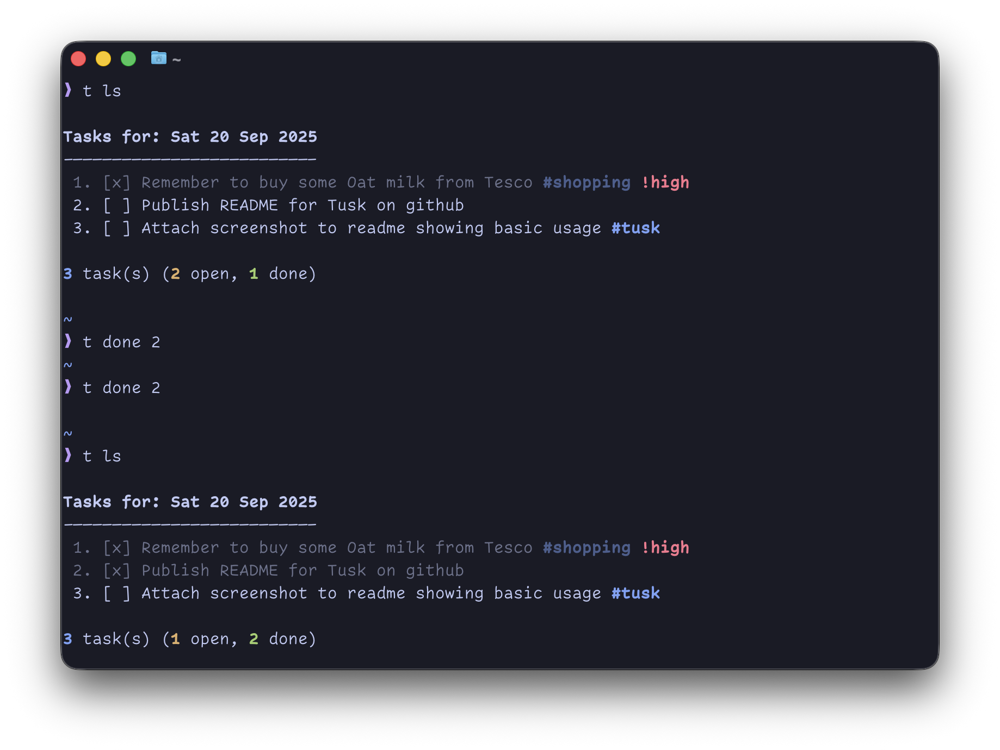
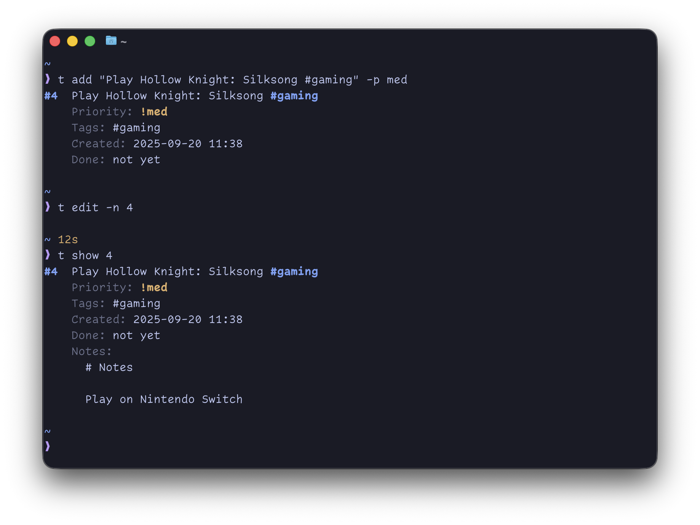

# 🦣 Tusk 

Tusk is a simple daily todo manager for your terminal.
It stores all your daily tasks in a JSON file and make its easy to add, list, mark, edit and export (soon). I took heavy inspiration from Git and wanted a command > action style terminal interaction.

## Installation

Due to Tusk being under development installation is a bit manual at the moment, however, I try to keep the `main` branch in a somewhat "releasable" state.

```bash
brew tap john-crossley/tap
brew install john-crossley/tap/tusk
tusk --version
```

#### Pro tip: alias tusk to a smaller command, for example `t`

For zsh:
```bash
printf "\nalias t='tusk'" >> ~/.zprofile
```
For bash:
```bash
printf "\nalias t='tusk'" >> ~/.bash_profile
```


## Usable

I'm going to assume you've aliased `tusk` to `t` if not sorry, just imagine `tusk` wherever `t` is 😅.

```bash
t [OPTIONS] <COMMAND>
```

### Global options

* `--data-dir <DIR>`: Override the base data directory.
* `-o`, `--output`: Outputs options `"md"|"json"|"terminal"`, defaults to `"terminal"`.
* `--no-colour`: Disable coloured output.
* `--verbose`: Enable verbose logging.

### Commands

### ls

List tasks for the day

```bash
t ls
t ls --tag work shopping
```

#### Options

* `-d`, `--date <YYYY-MM-DD>`: The from date, can use `yesterday`, `today`, `tomorrow`. Defaults to current date.
* `--tag <TAG>`: Filter tasks by one or more tags.

### add

Add a new task

```bash
t add "Drink more water #tag1 #tag2"
t add "Eat more fruit and nuts" -p high -n
```

#### Options

* `-d`, `--date <YYYY-MM-DD>`: The from date, can use `yesterday`, `today`, `tomorrow`. Defaults to current date.
* `-p, --priority <LEVEL>`: Set priority (low, med, or high), defaults to low.
* `-n`, `--notes`: Attach notes (opens in your editor).

### done

Mark a task as done by its index.

```bash
t done 3
```

### undone

Mark a task as undone by its index.

```bash
t undone 3
```

### rm

Remove a task by its index

```bash
t rm 3
```

### edit

Edit a task’s text and or notes.

```bash
t edit 4 "Count 🐑 before sleeping"
t edit 4 -n
t edit 4 -p high|med|low
```

#### Options

* `-d`, `--date <YYYY-MM-DD>`: The from date, can use `yesterday`, `today`, `tomorrow`. Defaults to current date.
* `-n`, `--notes`: Attach or edit notes.

### show

Show details of a single task.

```bash
t show 5
```
Displays the task, priority, tags, notes, and metadata in a nice formatted view.

#### Options

* `-d`, `--date <YYYY-MM-DD>`: The from date, can use `yesterday`, `today`, `tomorrow`. Defaults to current date.

### Migrate

Migrate tasks from one day to another, only migrates incomplete tasks.

```bash
t migrate --from yesterday
t migrate --from 2025-10-02 --to tomorrow
```

#### Options

* `-f`, `--from <YYYY-MM-DD>`: The from date, can use `yesterday`, `today`, `tomorrow`
* `-t`, `--to <YYYY-MM-DD>`: The to date, can use `yesterday`, `today`, `tomorrow`
* `--dry-run`: Output what will be migrated without actually performing the migration.

### Review

Review tasks from the last n days.

```bash
t review --days 10
```

#### Options

* `--days n`: The number of days to review (excludes current day).

### Examples

```bash
# Add a task with tags and priority
t add "Prepare slides for meeting #work !high"

# Mark it as done
t done 1

# Show details
t show 1

# List only work-related tasks
t ls --tag work

# End of the day and you still have incomplete actions.
t migrate --to tomorrow
```

### Screenshots




### Data storage

Tusk stores your todos as a single JSON file in a date based directory structure. Bt default, this lives under your systems app data dir, eg:

`~/.local/share/tusk/vaults/default/2025/09/20.json`

You will soon be able to organise todos into a different **"vault"** using the `--vault <name>` command.

### What's next?

* Persistent tasks. For those long running tasks that span multiple days.
* Rich metadata parsing, at the moment it's not very exciting but.. It'll better support `!priority`, `@time`, `#tags` and `>due`.

### Build from source 🦀

You’ll need [Rust](https://www.rust-lang.org/tools/install).

Clone the repository and build:

```bash
git clone https://github.com/john-crossley/tusk.git
cd tusk
cargo build --release
```

Your freshly baked 🍞 binary will be in:
`target/release/tusk`

You can move it somewhere on your $PATH for easier use, for example:

`cp target/release/tusk ~/.local/bin/`
